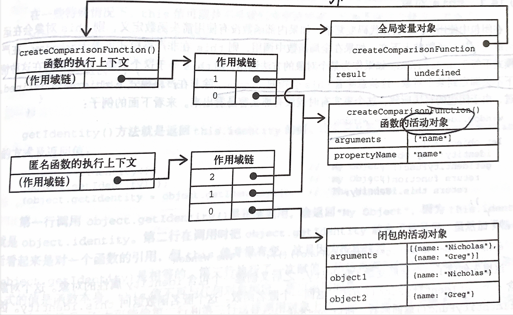

# 第10章 函数

## 函数声明方式

- 函数声明
- 函数表达式
- 箭头函数

## 10.1 箭头函数

- 和一般函数有什么不同？
    - 不能用arguments、supper、new target、不能用作构造函数，没有prototype属性

## 10.2 函数名

## 10.3 理解函数

## 10.4 没有重载

- 如何模拟重载？
    - 检查参数的类型和数量，分别执行逻辑

## 10.5 默认参数值

- 如何设置默认参数值
    - 使用=
- 什么是暂时性死区？
    - 按顺序初始化，前面不能引用后面

## 10.6 参数拓展与收集

## 10.7 函数声明与函数表达式

- 什么是函数声明提升？
    - Js引擎在代码执行前会读取函数声明，并在执行上下文中产生函数定义，这个过程也叫函数声明提升。但是函数表达式需要代码执行到他的那一行才会执行上下文生成函数定义。

## 10.8 函数作为值

## 10.9 函数内部

- arguments的callee属性如何使用？
    - 使用arguments.callee代替函数名字，主要功能是让函数逻辑和函数名解耦，用于递归调用，外部函数名改了以后也不影响内部代码使用。
- this的作用？
    - 是什么？this引用的是把函数当作方法调用的上下文对象
    - 如果是全局函数调用则指向window
    - 如果是对象调用，则指向对象
    - 在事件回调过程和闭包中，this指的不是想要的对象，有两种处理方法，一种是that = this，一种是把函数写成箭头函数，因为箭头函数this会保存创建时的上下文。
- caller是什么？
    - 调用当前函数的函数
- new.target是什么？
    - 检测函数是否用new调用

## 10.10 函数属性和方法

- 函数有什么属性？
    - length（函数定义参数个数）和prototype（引用类型所有实例方法）
- 函数有什么方法？都有什么用？
    - apply（this，array/arguments），采用指定this调用函数
    - call（this，参数1，参数...）,第一个参数和apply相同，但后面参数需要一个一个传
    - bind（对象），将this绑定给这个对象

## 10.11 函数表达式

- 什么叫匿名函数/兰姆达函数？
    - 先创建一个函数再把它赋值给一个变量，function后面没有标识符

## 10.12 递归

## 10.13 尾调用优化

## 10.14 闭包

- 什么是闭包？内部函数被返回在其他地方使用后，仍然引用那个变量，为什么？
  - 引用了另一个函数作用域变量的函数
  - 全局上下文叫做变量对象，代码执行期间始终存在，函数局部上下文叫活动对象，只在函数执行期间存在。
  - 定义compare函数是，执行上下文会创建作用域链，预装载全局变量对象，保存在内部[[Scope]]中，调用函数时会执行上下文，并复制函数的[[Scope]]创建作用链，并把活动对象插入作用域链前端，故createComparisonFunction作用域链0号位置指向活动对象。
  - 一个函数内部定义的函数会把其函数的活动对象也包含，所以匿名函数作用域链也包括createComparisonFunction的活动对象
   ```javascript
    let compare = createComparisonFunction('name')//闭包初始化，按name进行排序，返回的是一个函数
    let result = compare({name: 'Nicholas'}, {name: 'Matt'})//调用这个函数，传入两个obj
    console.log(result)

    function createComparisonFunction(name) {
             return function (obj1, obj2) {
                let val1 = obj1[name]
                let val2 = obj2[name]
                if (val1 < val2) {
                    return -1
                } else if (val1 > val2) {
                    return 1
                    } else {
                    return 0
                }
             }
        } 
  
  ```
  
- 闭包的缺点？如何解决？
  - 包含函数的作用域，占内存（内存泄露），并且活动对象会保存在内存里，直到匿名函数销毁才销毁。
  - 可以将匿名函数=null进行销毁
## 10.15 立即调用的函数表达式
## 10.16 私有变量